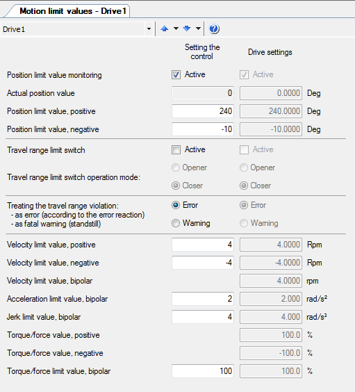
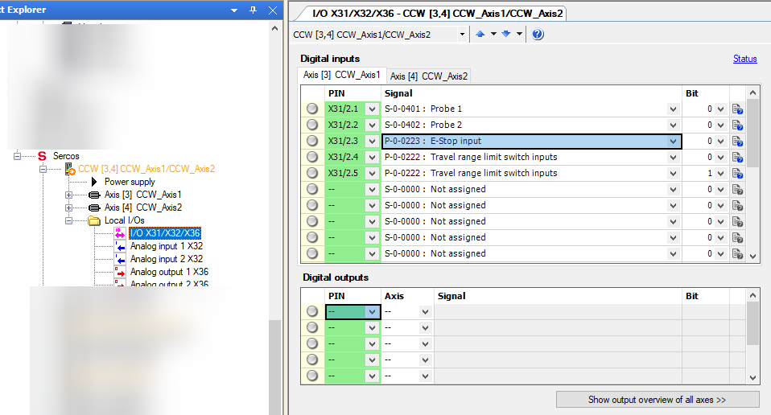

# Bosch Controller Startup and Configuration

| **Requested by:** | **GHESA**       |
| ----------------- | ---------       |
| **Doc. Code**     | --              |
| **Editor:**       | Julen García    |
| **Approved by:**  | Alberto Izpizua |

## Introduction

The aim of this document is to describe the commissioning process for all Bosch-Rexroth drives from its engineering tool.
The whole process of parameterization, configuration, etc., is done from IndraWorks Engineering.

The implemented architecture uses a MLC controller which acts as a gateway between the TMA-PXI and the drives, with which
it communicates using the Sercos III protocol, a native Bosch-Rexroth solution (see electrical schematics for connection
details).

## Configuration tool from Bosch

- Software name: IndraWorks Engineering
- Version: IndraWorks ML* 14v22 P4

## Configuring the MLC from the IndraWorks Engineering

The start-up can be done by connecting the drives one by one, or by connecting them all at once and select the motor from
the software. In the process described below, only one motor was connected.

The steps to follow once IndraWorks Engineering has been started are as follows:

- Create a project
- Right click on the new project *Scan devices*, to search for the controllers that are connected, in this case the MLC75
  with the defined address 192.168.212.3. At this stage it asks for the type of devices and by default select IndraDrive
  Ethernet.

  

  > If not found the device can be added by adding a IndraControl L45 to the project, Add -> IndraMotion MLC -> IndraControl L45

- To connect to the device press go to Project -> Switch the device online.
- Download Motion Configuration from PC to the control 
- At this point the the MLc is connected and it can be set to BB mode using the *P0*, *P2* and *BB* buttons
   or going to Sercos -> Sercos state.
- The default language is German, to set it to English go to the parameter C-0001 and define it as 1.

### Users

The default users for the MLC system could be:

| User          | Password      |
| ------------- | ------------- |
| boschrexroth  | boschrexroth  |
| administrator | administrator |

### Configure motors with integrated drive

These motors have a built-in drive, and power is provided by a KCU that allows up to 12 actuators to be connected in
series. In order to facilitate maintenance and spare parts management, all the MI used have the same reference number:
*KSM02.1B-041C-42N-M1-HP2-ET-L3-D7-NN-FW*.

One aspect to bear in mind is that they all come with the STO option, connector X141, which means that they must be
wired in all cases, either from the security PLC or by placing a *plug* (RBS0023) that bypasses the signals
(1-5, 2-7, 6-10 and 3-11), because otherwise the driver is in STO alarm.

It is possible to work with zones, wiring the first one to the security PLC and the following ones with the plug. If
just the STO from the KCU is used, it affects all the zones that are powered from the KCU.

The KCU apart from the STO signal, also transmits the E_STOP signal, that is wired in the X50.3 of the
KCU, to all the motors. For this signal wired to the X50.3 an input of 0V means that the stop signal is activated, so
there must be 24V to move all the axes. This configuration does not require any parameterization and it is only
necessary to remove the default jumpers and insert the signal that comes from the PILZ that by default must be a "1", 24V.

#### Parametrization of the drives

When it comes to accessing the parameters, it can be done from Real Axis or from Sercos. The difference is that from the
Real Axis the A and C parameters of the control are modified, and the Sercos the S and P parameters of the drive are
modified. To avoid parameter inconsistency error that could appear if the S/P parameters differ from the A/C parameters,
it is best to always work from Motion Real Axis because then they rewrite the value of the drive and so there are no
problems. It also helps to keep the parameters in the project as a backup in case the hardware gets damaged, as the S/P
parameters are not stored in the project.

#### Set the language to English

Change the language to English, to do this for Drive1, go to Drive1 -> Parameters -> Parameter selection, that opens a
window where the parameter the user wants to change is specified, in this case the `S-0-0265 = 1` so that the texts
appear in English.

#### Axis encoder configuration

When configuring an axes it is important to look at Drive*X* -> Motor -> Encoder and the value that appears in `Absolute
encoder range`, because it will indicate the travel available with the configured mechanical transmission. For example
the mirror cover with the encoder and the mechanical transmission combination the available range is of 1446 degrees,
when only ~150 deg are needed. This could represent a problem if the reduction is much greater, it is important to check
this for a new axis or changes in the encoder mechanical transmission combination.

#### Set mechanical parameters

For setting the parameters for the mechanical actuation go to Motion -> Real Axis -> Drive1 and set the scaling units
to match the real mechanical system.

##### Parametrization example for one mirror cover motor

Mechanical specifications for the mirror cover:

- Motor 5500 rpm
- Range limit 150 deg
- Reduction module i:339.911
- Crown i:3
- max speed 5 rpm
- max acceleration 2 rd/s2
- max jerk 4 rd/s3

The reductor and the crown relations give and outcome of 1019.733, but as no decimal values can be used, both n1 and n2
are multiplied by 1000 to obtain a relation using integer values as follows:

- n1 1019733
- n2 1000

Specify that the axis is rotative, with absolute measurement, and that the measurements are from the load. Here the
direction can be flipped if needed.

For the motion limits the specification limits and cinematic limits must be taken into account.

Once the basic parameters have been set, as it has absolute encoder, it is necessary to initialize the counter,
indicating the current position in *Reference distance* and click on *Set Absolute Position*.

##### Mirror cover parameters

The mirror cover is a protective deployable cover for the main mirror (M1M3) and the mirror cover locks are complementary
elements for locking the mirror cover to prevent any interferences with the optical path while moving the TMA.

| Kinematics           |                    | Use case   |                  |         |
|----------------------|--------------------|------------|------------------|---------|
| Motor                | 5500rpm            |            | Travel limit     | 150º    |
| Reductor             | i:339.911          |            | max speed        | 5 rpm   |
| Corona + primer engr | 1/3 48/52 (i:3.25) |            | max acceleration | 2 rd/s2 |
| N1                   | 1104710.75         |            | max jerk         | 4 rd/s3 |
| N2                   | 1000               |            |                  |         |
| Limit encoder abs    |                    |            |                  |         |
| Speed limit          | 4.97 rpm           |            |                  |         |

##### Mirror cover locks parameters

The locks for the mirror cover.

| Kinematics          |           | Use case   |                  |         |
|---------------------|-----------|------------|------------------|---------|
| Motor               | 5500rpm   |            | Travel limit     | 150º    |
| Reductor            | i:339.911 |            | max speed        | 10 rpm  |
| Corona              | i:1       |            | max acceleration | 4 rd/s2 |
| N1                  | 339911    |            | max jerk         | 8 rd/s3 |
| N2                  | 1000      |            |                  |         |
| Limit encoder abs   |           |            |                  |         |
| Speed limit         | 16.2 rpm  |            |                  |         |

##### Locking pins parameters

These are two pins that are inserted one at each side of the elevation axis to lock it and prevent any movements.

| Kinematics         |              | Use case   |                  |            |
|--------------------|--------------|------------|------------------|------------|
| Motor              | 5500rpm      |            | Travel limit     | 100 mm     |
| Paso               | 0.164 mm/rev |            | max speed        | 450 mm/min |
| Corona             |              |            | max acceleration | 2000 mm/s2 |
| N1                 |              |            | max jerk         |            |
| N2                 |              |            |                  |            |
| Limit encoder abs  |              |            |                  |            |
| Speed limit        |              |            |                  |            |

##### Deployable platforms parameters

These are maintenance platforms for accessing the camera and M2 when the telescope is pointing to horizon.

| Kinematics         |              | Use case   |                  |                         |
|--------------------|--------------|------------|------------------|-------------------------|
| Motor              | 5500rpm      |            | Travel limit     | 2335 mm DP1 2342 mm DP2 |
| Reductor           | i:45         |            | max speed        | Min 15.59 mm/s          |
| Pinion diameter    | 90 mm        |            | max acceleration |                         |
| N1                 |              |            | max jerk         |                         |
| N2                 |              |            |                  |                         |
| Limit encoder abs  |              |            |                  |                         |

##### Balancing system parameters

The arrangement of the balancing system actuators on the CST is shown in the picture below. The horizontal ones
(when the telescope points to the zenith), called BS90 because they balance when the telescope points to the horizon
α=90º, are on one side and do not cut the axis of rotation, therefore the load always causes a positive unbalance,
which will be greater or lesser, but does not invert the sign, which is why the 0 has been placed in the position
closest to the axis and therefore with the least unbalance, but it can never be cancelled.

The verticals (when the telescope points to the zenith), called BS0 because they balance when the telescope points to
the zenith α=0º, however if they cross the axis and therefore can invert the unbalance, as we have no reference of the
central position, the zero has been placed in the lower position. (If in the future it is possible to determine the
central position, the origin could be changed to the same, so that the sign of the position corresponds to the sign of
the unbalance).

| Kinematics         |         | Use case   |                  |                         |
|--------------------|---------|------------|------------------|-------------------------|
| Motor              | 5500rpm |            | Travel limit     | 1190 mm (H) 1400 mm (V) |
| Paso               | 5mm     |            | max speed        | 2000 mm/min             |
| Reductor           | 1:1.5   |            | max acceleration | 2000 mm/s2              |
| N1                 |         |            | max jerk         | 4000 mm/s3              |
| N2                 |         |            |                  |                         |
| Limit encoder abs  |         |            |                  |                         |
| Speed limit        | 600 rpm |            |                  |                         |

#### Move axis from the indraworks tool

To move the axis in both jog and position mode, there is an option in the software Motion -> Axis Commissioning where a
screen like the one below appears, letting the user move the desired axis.

#### Tune an axis

Axis tunning, once mounted with all the kinematic chain, an automatic tunning of parameters can be made, for this it is
necessary to place the axis in an intermediate position and go to the section, Motion -> Real axes -> Optimization and
commissioning. Here it automatically calculates several parameters, by making a small oscillation.

> This tool does not always work, when setting up the TMA for the first time this tool only worked for a couple of
> systems, therefore manual tunning knowledge is recommended.

#### Adding travel hardware limits (limit switches) to an axis

To assign the limit switches connected to the X37 and X38 of the driver itself, as movement limits, go to the I/O
section in the Sercos -> Drive*X* -> Local I/Os -> I/O X37/X38.

#### Define sercos as a ring

The Sercos III ring can be closed or open, at a functional level both are valid, the only thing is that if it is closed,
when it is cut a certain point, it is automatically redirected and remains operative. The options the tool offers are:

- No redundancy detection -> no ring
- Redundancy detection on -> ring
- Redundancy detection with ring recovery -> ring that recovers

The desired option value is *Redundancy detection with ring recovery*, but if for some reason the ring is not closed the
option *No redundancy detection* should be used to warning messages.

#### When a motor is not available

If there are axes that are not physically connected, it is necessary to put them in parking mode, to be able to put the
MLC in BB (run mode) and use the rest of the drives. To put an axis in parking, right click on the axis and select parking.

### MSK motors configuration

It applies the same as before for the motor with the integrated drive, the only difference here is that these motors are
connected to a dual drive that manages two motors.

One of the problems that arises in this case is that both motors drive the same crown wheel, as these are used for both
cable wraps ACW and CCW. The normal working mode is having one disabled while the active one is moving the crown, but
this implies that the brake of the one that is disabled must be released so that it can be dragged. In addition, for the
ACW as it can be dragged by azimuth when stopping, the solution was to remove the brakes for these two motors. The brake
management for the CCW is done by the code running in the TMA-PXI using digital outputs wired to the drive.

For startup there is an option in the indraworks tool for forcing the release of the brakes, this is done automatically
when enabling the axis, but as for the CCW one of the drives is disabled, the other brake must be forced to be able to
move it.

- Go to the brake management page, Motion -> Real Axes -> Drive*X* -> Motor, brake, measuring systems -> Brake.
- Allow brake release.

  

- Release holding brake

  

In this case as the drive controls to different motors the STO and E_STOP signals can be different from each of the
motors, this can be defined in the I/O configuration screen inside the sercos section for each of the drives.

#### AZCW MSK070

Cable wrap for the azimuth axis, must follow the azimuth axis to correctly guide the wires and pipes under the TMA.

Drive HMD01-1N-0036-R-07-NNNN

Control CSB02-1B-ET-EC-EC-NN-L3-L3-NNNN-FW

Motor MSK070C-0300-NN-M2-UG1-RNNN

| Kinematics         |                             | Use case   |                  |                       |
|--------------------|-----------------------------|------------|------------------|-----------------------|
| Motor              | 5500rpm                     |            | Travel limit     | ±284º                 |
| Reductor           | 20167/208                   |            | max speed        | 1.75rpm (10.5º/s)     |
| Corona             | 1452/78                     |            | max acceleration | 0.18 rd/s2 (10.5º/s2) |
| N1                 | 1804887                     |            | max jerk         | 0.10 rd/s3 (6º/s3)    |
| N2                 | 1000                        |            |                  |                       |
| Limit encoder abs  | 816º                        |            |                  |                       |
| Speed limit        | 1.66 rpm Nom 3.044 rpm max. |            |                  |                       |

#### CCW MSK040

Cable wrap for the camera, must follow the camera rotator to correctly guide the wires and pipes that reach to the camera.

Drive HMD01-1N-0012-R-07-NNNN

Control CSB02-1B-ET-EC-EC-NN-L3-L3-NNNN-FW

Motor MSK040B-0450-NN-M2-UG1-NNNN

| Kinematics         |               | Use case   |                  |                       |
|--------------------|---------------|------------|------------------|-----------------------|
| Motor              | 4500rpm       |            | Travel limit     | ±94º                  |
| Reductor           | i:210         |            | max speed        | 0.875 rpm (5.25º/s)   |
| Corona             | 936/108       |            | max acceleration | 0.026 rd/s2 (1.5º/s2) |
| N1                 | 1820          |            | max jerk         | 0.1 rd/s3 (6º/s3)     |
| N2                 | 1             |            |                  |                       |
| Limit encoder abs  | 810º          |            |                  |                       |
| Speed limit        | 2.47 rpm nom  |            |                  |                       |

## Restore MLC to factory defaults

The steps for restoring the settings to the default ones are:

1. Disconnect the 24V power from the MLC.
2. Disconnect the Sercos and communications wires.
3. Connect the 24V power to the MLC and press the *ESC* and *ENTER* buttons until *BOOTSTOP* is displayed on the screen.
4. Navigate until *CLEANUP?*.
5. Press the *ENTER* button.

The manual says that after this procedure the user configuration can be loaded from the project using the following path:
MLC -> Synchronize -> Download from PC to control.
